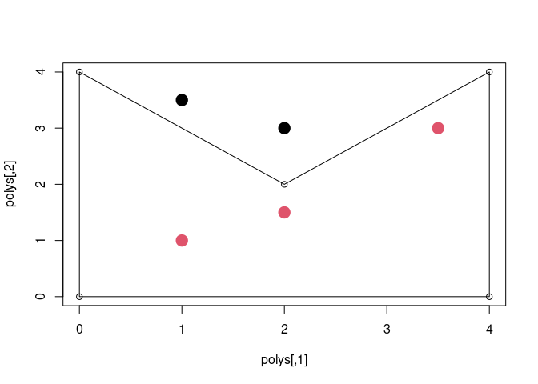

<!-- README.md is generated from README.Rmd. Please edit that file -->
<!-- badges: start -->

[](https://github.com/diminutive/insidecgal/actions)
<!-- badges: end -->

# insidecgal

The goal of insidecgal is to provide fast point in polygon lookup with
cgal.

See <https://github.com/diminutive/insidecpp11> for now, we’re working
on finding the best ways to wrap this up.

``` r
polys <- cbind(c(0, 4, 4, 2, 0), 
               c(0, 0, 4, 2, 4))

pts <- cbind(c(1, 2, 1, 2, 3.5), 
             c(1, 1.5, 3.5, 3, 3))
plot(polys);polygon(polys)
points(pts, pch = 19, cex = 2, col = insidecgal:::point_in_polygon_cgal(pts[,1], pts[,2], polys[,1], polys[,2]) + 1)
```

 ## Code of
Conduct

Please note that the insidecgal project is released with a [Contributor
Code of
Conduct](https://contributor-covenant.org/version/2/0/CODE_OF_CONDUCT.html).
By contributing to this project, you agree to abide by its terms.
